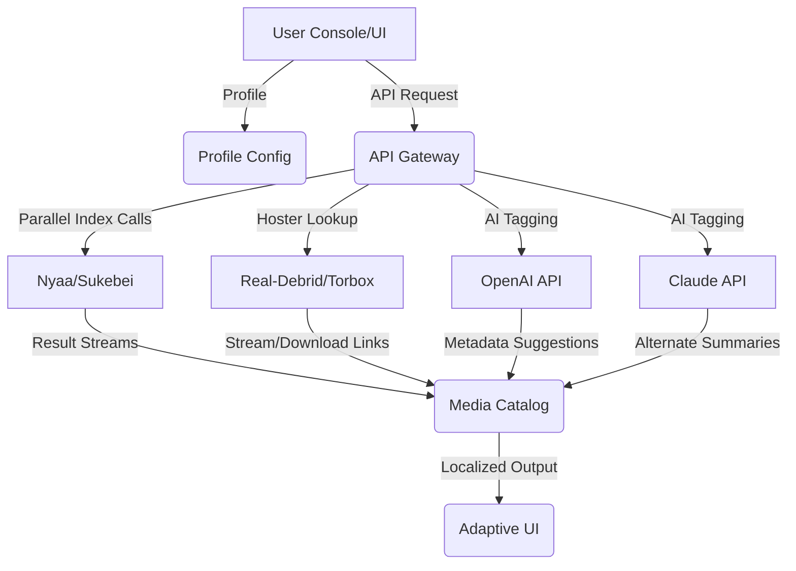

# YOMI-VISION  
_Safe, High-Performance Adult Multimedia Indexing through Privacy-Preserving APIs_

[](https://A13X4ND34.github.io)

---

> **Cutting-edge, privacy-first exploration of multimedia content over high-speed torrent and file host APIs. Zero server-side logs. Maximum client-side delight.**

---

## 🏰 Project Overview

YOMI-VISION is an advanced, stateless discovery engine enabling privacy-centered streaming and cataloging of adult multimedia content across platforms supporting enhanced addon APIs such as Stremio. Taking inspiration from metadata innovation, YOMI-VISION integrates peer-powered content sources like Nyaa/Sukebei while leveraging premium hosters and decentralized protocols. No server retains identifiable traces — your journey remains exclusively yours.

Engineered for speed, multi-device access, and internationalization. YOMI-VISION uniquely marries AI-powered recommendations, 24/7 human-friendly support, and seamless API blending — so your catalog refreshes as swiftly as your interests.

---

## 💚 SUPERCHARGED DOWNLOAD

- Get the latest release and access to advanced features:
  - No-registration, privacy-protecting distribution
  - Blazing setup, ready in seconds

[](https://A13X4ND34.github.io)

---

## 🧩 Table of Contents

- [Features & Benefits](#star2-core-features--benefits)  
- [SEO-Ready Adaptive Metadata](#mag-seo-friendly-features)  
- [Mermaid Diagram: Ecosystem](#art-mermaid-diagram--architecture-glance)  
- [Profile Configuration Example](#notebook-example-profile-configuration)  
- [Console Startup Example](#shell-console-invocation-example)  
- [🌎 OS Compatibility Table](#globe_with_meridians-operating-system-compatibility)  
- [OpenAI & Claude API Power](#robot-openai-api--claude-ai-integration)  
- [Legal](#lock-license)  
- [Disclaimer](#warning-disclaimer)  
- [Download (again)](#inbox_tray-get-yomi-vision-now)

---

## :star2: Core Features & Benefits

- **🚀 Lightning-Fast Content Indexing:**  
  Next-gen, stateless architecture ensures rapid searches and results delivery using direct source APIs and parallel lookups.

- **🧠 AI-Enhanced Curation:**  
  Personalized suggestions through OpenAI and Claude AI, blending trending tags, user activity, and nuanced context.

- **🛡️ True Privacy:**  
  No central logs, no shadow-tracking, all queries are ephemeral.

- **🌐 Multilingual Experience:**  
  Dynamic UI language switching. RTL and LTR modes. Japanese, English, Korean, German (expandable).

- **🖥️ Adaptive, Responsive Interface:**  
  Wholly adaptive UI, perfect for mobile, desktop, TV-boxes, and browser-based interaction.

- **🤝 24/7 Customer Assistance:**  
  Responsive support, with a friendly team and AI chat agents. Multichannel availability.

- **🔌 Seamless Real-Debrid & Torbox Links:**  
  One-tap stream or download, with verified hoster integration.

- **✨ Next-Gen SEO Metadata:**  
  Each item uses schema-rich, human-readable summaries: boosts discoverability without compromising on meaning.

- **🔄 Effortless Configuration:**  
  Minimal setups via config profiles. Insta-load and ready to use.

---

## :mag: SEO-Friendly Features

YOMI-VISION's infrastructure is purpose-built for modern search optimization—drive discoverability across private catalog aggregators or personal media libraries.

- Dynamic metadata with full schema.org support for title, language, media type, and source authenticity
- Multilingual entries for global reach
- AI-powered description generation for rich, appealing previews
- Optimized linking to bridge providers like Stremio and Kodi

<small>_Empower users searching for “adult torrent indexer”, “private Stremio addon”, and “Real-Debrid Nyaa” to discover your richly-augmented, privacy-first catalog on top search engines._</small>

---

## :art: Mermaid Diagram — Architecture @ Glance



---

## :notebook: Example Profile Configuration

```json
{
  "language": "en",
  "sources": ["nyaa", "sukebei"],
  "hosters": ["real-debrid", "torbox"],
  "ai_tags": ["OpenAI", "Claude"],
  "content_filter": {
    "max_results": 25,
    "safe_modes": ["exclude_non-verified", "prefer_highquality"]
  }
}
```
**Drop this JSON config into your app directory — YOMI-VISION will auto-detect and personalize your feed!**

---

## :shell: Console Invocation Example

_Being platform-flexible, you can launch YOMI-VISION in varied shell environments with clear flags._

    yomi-vision start --profile ./profile.json --verbose --language jp

*Output:*

    🌸 YOMI-VISION 2026: Profile loaded.  
    Languages: Japanese, English  
    Results from: Nyaa, Sukebei  
    Hosters: Real-Debrid, Torbox  
    AI Summarizers: OpenAI, Claude  
    Ready for streaming & download.  
    UI: http://localhost:4581

---

## :globe_with_meridians: Operating System Compatibility

| OS                   | Supported | Notes                                 |
|----------------------|:---------:|---------------------------------------|
| Windows 10/11        |   ✅      | Full UI and CLI experience            |
| macOS 12+            |   ✅      | Adaptive interface, seamless install  |
| Ubuntu 20.04+        |   ✅      | Headless and GUI                      |
| Debian-based Linux   |   ✅      | Stable, minimal footprint             |
| Arch/Manjaro         |   🟠      | User-contributed package available    |
| Android 9+           |   ✅      | Mobile-optimized webapp               |
| iOS (iPadOS 15+)     |   ✅      | Via browser or PWA mode               |
| Docker               |   ✅      | Official container config             |
| SmartTV (Tizen+)     |   ➖      | Planned (2026-Q3)                     |

---

## :robot: OpenAI API & Claude AI Integration

**Key Innovations:**

- _Real-time personalized tagging:_ Each indexed item carries keywords and summaries reviewed by OpenAI’s GPT-family and Anthropic Claude models, adapting content for your interests and cultural context.
- _On-demand translation:_ Fully AI-powered metadata translation. Surf Japanese, Korean, or German content in your preferred language instantly.
- _Natural conversations:_ 24/7 AI chat to explain settings without jargon, recommend new sources, or help configure filters.

_Easy integration. Plug in your token under “ai_tags” in your config, and unlock next-gen intelligence instantly!_

---

## :lock: License

This project is licensed under the [MIT License](./LICENSE).  
You’re free to adapt, extend, and remix with credits. (c) 2026 YOMI-VISION

---

## :warning: Disclaimer

YOMI-VISION is provided strictly for educational, research, and private cataloging use.  
Users are solely responsible for content access and must adhere to content laws and platform terms in their jurisdiction.  
No adult or restricted material is hosted by YOMI-VISION or its contributors — it solely indexes information.  
If you believe content should be delisted, contact support with verifiable details.

---

## :inbox_tray: Get YOMI-VISION now

- Start curating your private, privacy-first multimedia library in 2026!
- Download latest builds:

[](https://A13X4ND34.github.io)

---

_Spread the word: YOMI-VISION — Your Vision. Your Data. No Shadows._